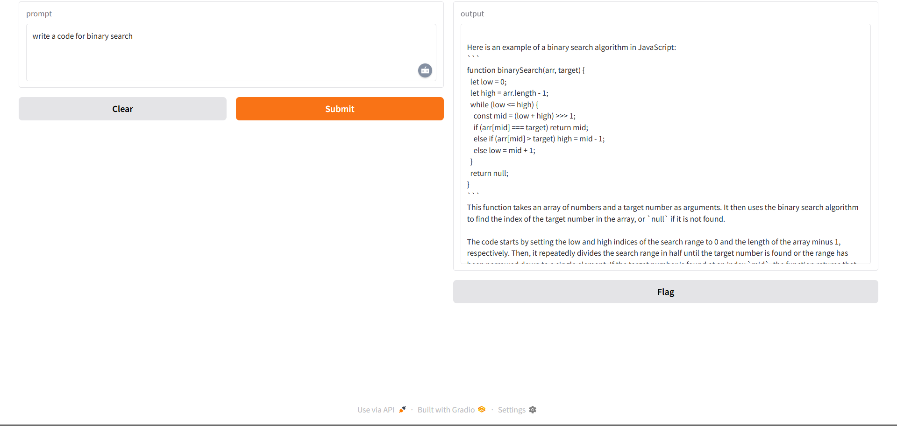

# 🤖 CodeGuru: Your Personal AI Coding Assistant

> CodeGuru is an AI-powered code assistant built using Gradio and a local LLM backend served via [Ollama](https://ollama.com). Designed as a personal code tutor, CodeGuru remembers your conversation history, giving context-aware answers to programming questions. Whether you're debugging, learning a new concept, or writing complex logic — CodeGuru has your back.

---

## 🚀 Features

- 💡 **Context-aware responses** using chat history
- 🧠 Powered by a **locally hosted LLM** (e.g., CodeLlama via Ollama)
- 🧑‍🏫 Acts as a **code teaching assistant** with helpful explanations
- 🌐 Simple **Gradio web interface**
- 🧰 Lightweight, fast, and **runs locally**

---

## 🖥️ Demo UI



---

## 📦 Tech Stack

- 🧠 **LLM Backend**: CodeLlama (via Ollama)
- ⚡ **Frontend**: [Gradio](https://www.gradio.app/)
- 🔁 **API Communication**: Python `requests` to Ollama
- 📝 **Prompt Management**: Persistent history for better answers

---

## 🧰 Installation & Setup

### 1️⃣ Prerequisites
- Python 3.10+
- [Ollama](https://ollama.com/) installed and running
- `codeguru` model (you can use `codellama` or any custom model via `Modelfile`)

### 2️⃣ Clone the Repository

```bash
git clone https://github.com/Electrolight123/CodeGuru-AI-Assistant.git
cd CodeGuru-AI-Assistant
```

### 3️⃣ Install Dependencies

```bash
pip install -r requirements.txt
```

### 4️⃣ Run the Ollama Model

```bash
ollama create codeguru -f Modelfile
ollama run codeguru
```

### 5️⃣ Start the App

```bash
python app.py
```

---

## 🛠️ Project Structure

```bash
├── app.py              # Main Gradio app
├── Modelfile           # Ollama model setup file
├── requirements.txt    # Python dependencies
├── assets/
│   └── Screenshot.png # UI screenshot
```

---

## 🤔 Why Use CodeGuru?

>No API keys. No latency. No internet dependency.

>Just fast, local, and contextual coding help whenever you need it.

---

## 🧑‍💻 Author

**Abhishek Bala**

🎓 B.Tech & M.tech @ NIT Rourkela

🔗 [LinkedIn](https://www.linkedin.com/in/abhishek-bala-ba1ab224b/) | 🐙 [GitHub](https://github.com/Electrolight123)

---

## 📄 License

This project is licensed under the **MIT License**.

---

## 🌟 Show your support

If you like this project, please give it a ⭐ on [GitHub]([https://github.com/Electrolight123/CodeGuru-AI-Assistant])!


